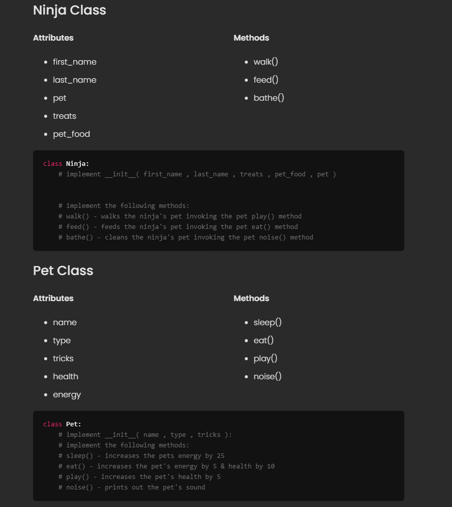

# DOJO PETS
Create a Ninja class and a Pet class. Ninja's will be able to have a pet
### Objectives:
* Create a Ninja class with the ninja attributes listed.
* Create a Pet class with the pet attributes listed.
* Implement walk(), feed(), bathe() on the ninja class.
* Implement sleep(), eat(), play(), noise() methods on the pet class.
* Make an instance of a Ninja and assign them an instance of a pet to the pet attribute.
* Have the Ninja feed, walk , and bathe their pet.
### Additional functionality for extra practice:
* BONUS: Use modules to separate out the classes into different files.
* BONUS: Use Inheritance to create sub classes of pets.
## I was given this as a starting point::
